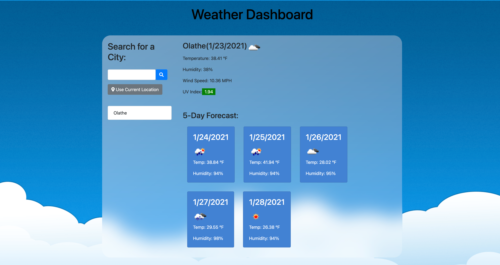
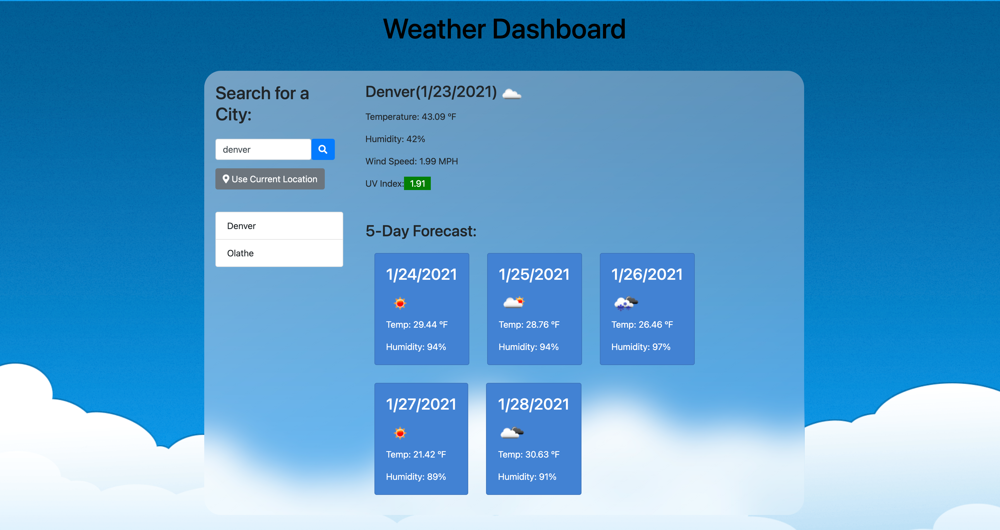
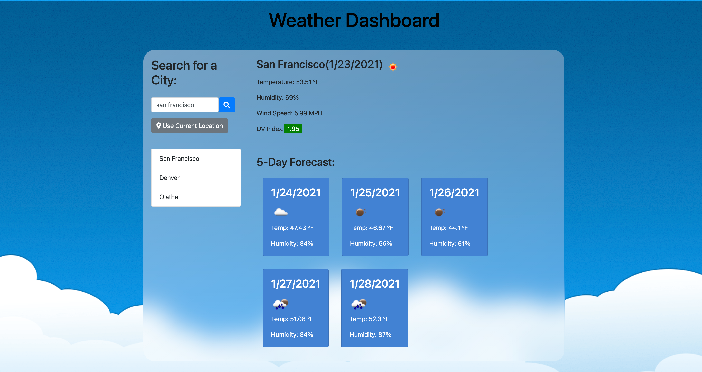
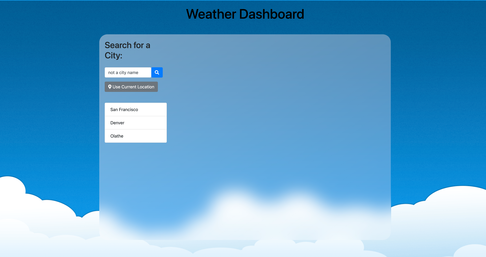
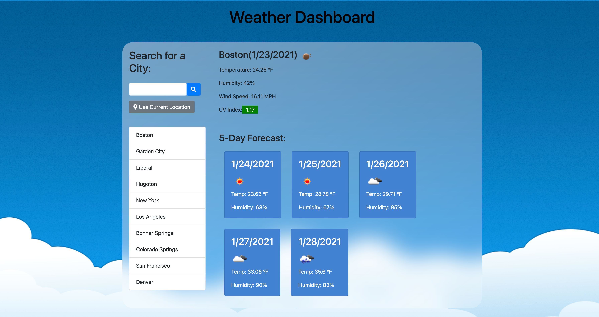
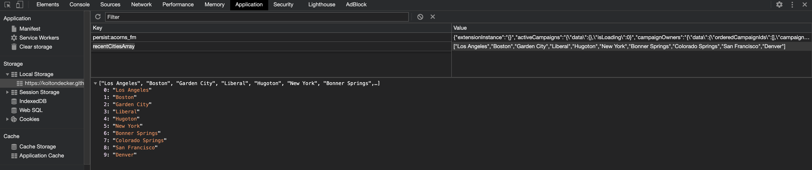
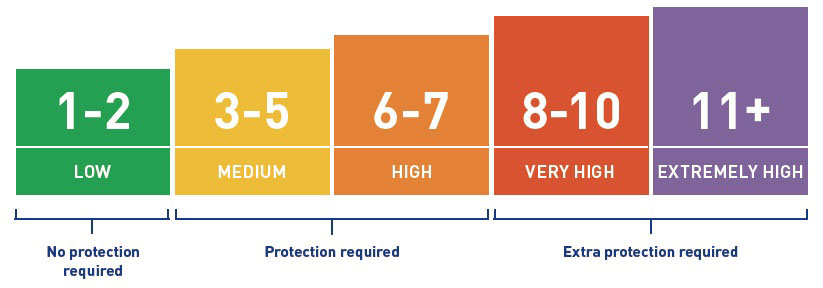

# 06 Server-Side APIs: Weather Dashboard

<strong>View Deployed Project here:<strong> https://koltondecker.github.io/Weather-Dashboard/

Everyone has to deal with weather and everyone needs to know what the weather is, maybe in multiple parts of the world at once. With my weather dashboard application, you can view current weather information and a 5 day forecast for any city you search for (This is limited to the most popular result for that searched city. Plans are to implement more targeted searches in the future to ensure you can differentiate duplicate city names.) This is all done with the power of APIs. Geolocation-DB API and ipapi API are both used for getting current location from the user. OpenWeatherMap API's are used to get the current weather, uv index, and 5 day forecast for the searched city. Information is dynamically created and appended to page. 

Users don't want to have to search for their commonly searched for cities each time they open their weather dashboard either so I have created a 10 most recently searched list on the left side. The weather dashboard also displays the last searched for city on application open. All recent cities are saved in local storage. 


## User Story

```
AS A traveler
I WANT to see the weather outlook for multiple cities
SO THAT I can plan a trip accordingly
```

## Acceptance Criteria

```
GIVEN a weather dashboard with form inputs
WHEN I search for a city
- [x] THEN I am presented with current and future conditions for that city and that city is added to the search history
WHEN I view current weather conditions for that city
- [x] THEN I am presented with the city name, the date, an icon representation of weather conditions, the temperature, the humidity, the wind speed, and the UV index
WHEN I view the UV index
- [x] THEN I am presented with a color that indicates whether the conditions are favorable, moderate, or severe
WHEN I view future weather conditions for that city
- [x] THEN I am presented with a 5-day forecast that displays the date, an icon representation of weather conditions, the temperature, and the humidity
WHEN I click on a city in the search history
- [x] THEN I am again presented with current and future conditions for that city
WHEN I open the weather dashboard
- [x] THEN I am presented with the last searched city forecast
```

The following image demonstrates the application functionality:

<h2><strong>General Functionality:</strong></h2>

- This is what the page looks like on initial page load. No weather information is displayed and no recent searches are shown if user is visiting site for the first time:
<br>
<br>

<br>
<br>
- When the current location button is pressed, weather data based on your current location is displayed and that location is added to your recent searches on the left:
<br>
<br>

<br>
<br>
- When searching the city of "Denver", weather data is shown for Denver:
<br>
<br>

<br>
<br>
- Cities with spaces in their names are still properly looked up as long as the city is spelled correctly:
<br>
<br>

<br>
<br>
- When something is searched that is not a city, no data will display on the page and the non-city value will not be added to recent searches:
<br>
<br>

<br>
<br>
- The recent searches list holds up to 10 different cities as displayed here:
<br>
<br>

<br>
<br>
- If a new city is searched when the list is full, the last (or 11th) value will be cut off and forgotten about:
<br>
<br>

<br>
<br>
- The list of recent searches also acts as a list of buttons that you can select to load that cities weather data to the page:
<br>
<br>

<br>
<br>
- When that city button is pressed, the city is moved to the top of the list of recent searches and weather data is displayed:
<br>
<br>

<br>
<br>
- Local storage holds the list of recent searches and is parsed each time page is visited to display recent searches list. Last searched city is also displayed on the page on load.
<br>
<br>

<br>
<br>
- The scale below denotes the UV Index threshold scale that is utilized to display the appropriate color around the uv index value on the page.
<br>
<br>


## Review

You are required to submit the following for review:

- [x] * The URL of the deployed application.

- [x] * The URL of the GitHub repository. Give the repository a unique name and include a README describing the project.

- - -
